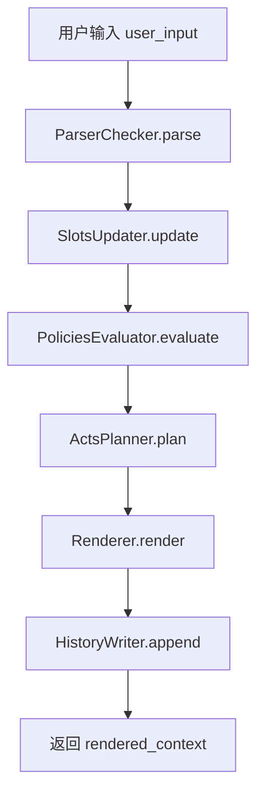
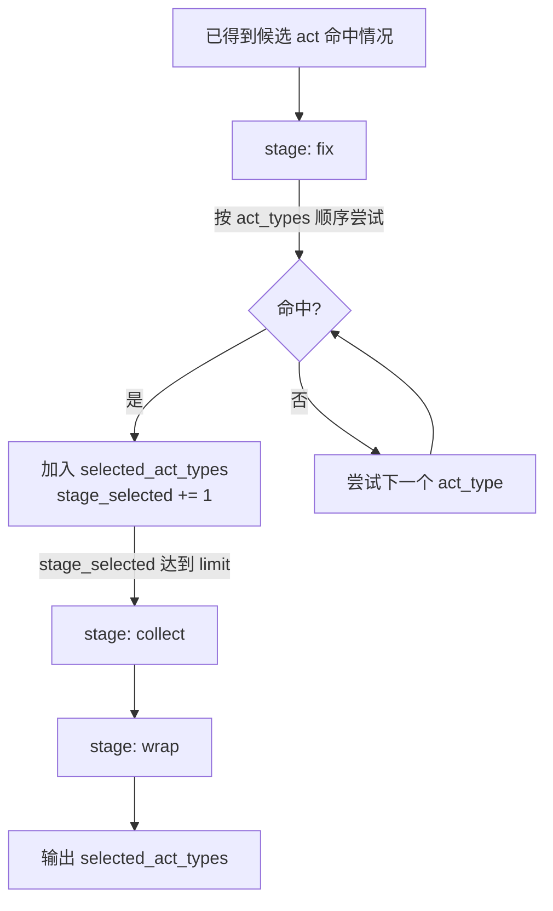

## 文档目的
本报告描述 requirements_interview v2 领域包在一次对话回合（turn）内的完整执行流程，并逐段对应 domain_packages/requirements_interview.json 的各个部分，便于你后续自定义 domain package 而不改引擎代码。

关联文件：
- 领域包：[requirements_interview.json](file:///workspace/domain_packages/requirements_interview.json)
- 引擎入口：[main.py](file:///workspace/main.py#L34-L51)
- 解析器：[Parser_Checker.py](file:///workspace/Parser_Checker.py)
- 槽更新器（含 checkpoint/freeze/冲突候选）：[slots_Updater.py](file:///workspace/slots_Updater.py)
- 策略评估器：[policies_Evaluator.py](file:///workspace/policies_Evaluator.py)
- 动作规划器（含 turn_pipeline、多 act、focus 分组）：[acts_Planner.py](file:///workspace/acts_Planner.py)
- 渲染器（输出给外部执行代理）：[Renderer.py](file:///workspace/Renderer.py)
- 历史写入：[history_Writer.py](file:///workspace/history_Writer.py)
- 领域包字段指南：[DomainPackageSchema使用指南.md](file:///workspace/doc/DomainPackageSchema使用指南.md)

## 一、回合主流程（固定）
每一轮 turn 的执行链路固定为：
1. ParserChecker.parse：把 user_input 转为 parsed_intentions / candidate_slot_values / resolved_slot_values
2. SlotsUpdater.update：写入槽（fill/update）、维护冲突候选（candidates）、推进 checkpoint、执行 freeze
3. PoliciesEvaluator.evaluate：根据 trigger.conditions 选择 policy，并产出 completion_state
4. ActsPlanner.plan：按 turn_pipeline 组合多个 act（selected_act_types），并为每个 act 计算 focus_slot_ids_by_act
5. Renderer.render：把 checkpoint/policy/act/focus/intentions 汇总为外部执行代理上下文
6. HistoryWriter.append：把本轮结果写入 interactionIR.history

入口代码：[run_turn](file:///workspace/main.py#L34-L51)

### Mermaid：主链路流程图

## 二、与领域包各部分的对应关系

### 2.1 顶层元信息
对应 JSON 字段：
- domain_id / version / description / slot_status_enum

用途：
- domain_id/version 用于 interactionIR.meta 绑定领域包版本（运行时加载时按 meta 寻址）。
- slot_status_enum 用于 slot 初始化 status 选择（如果 blueprint 未覆盖）。

相关实现：
- 初次创建 interactionIR：[Creator._build_empty_interaction_ir](file:///workspace/Creator.py#L172-L200)
- slot 初始状态选择：[Creator._make_slot_instance](file:///workspace/Creator.py#L201-L219)

### 2.2 parser_guidance（解析器提示）
对应 JSON 字段：
- parser_guidance.instruction

用途：
- 只用于构造解析器提示词；不参与任何硬编码业务逻辑。

相关实现：
- [ParserChecker._parser_instruction](file:///workspace/Parser_Checker.py#L280-L285)

### 2.3 slot_blueprint_catalog（槽定义）
对应 JSON 字段：
- slot_blueprint_catalog[].slot_key/title/value_type/creation_rule/update_rule/renderer

用途分三类：
1. 初始化：create_at_init=true 的槽会被 Creator 创建进 interactionIR.slots。
2. 更新：SlotsUpdater 根据 update_rule 决定“冲突标记”还是“覆盖更新”。
3. 渲染：Renderer 使用 renderer.missing_hint/value_hint 来生成焦点槽说明。

相关实现：
- 初始化：[Creator._build_empty_interaction_ir](file:///workspace/Creator.py#L172-L200)
- 冲突处理/候选保存：[SlotsUpdater._apply_candidate](file:///workspace/slots_Updater.py)
- 焦点槽渲染：[Renderer._focus_slot_line](file:///workspace/Renderer.py#L170-L200)

### 2.4 intention_catalog（意图集合）
对应 JSON 字段：
- intention_catalog[].intention_type/description/renderer.instruction

用途：
- 解析器输出 parsed_intentions 时只能使用这里定义的 intention_type。
- 渲染阶段会把意图文案拼入“用户本轮情况”。

相关实现：
- 解析允许集：[ParserChecker._allowed_intentions](file:///workspace/Parser_Checker.py#L260-L268)
- 渲染意图说明：[Renderer.render](file:///workspace/Renderer.py#L67-L77)

### 2.5 checkpoint_catalog（阶段推进 + freeze + 偏好）
对应 JSON 字段：
- checkpoint_catalog[].entry_conditions
- checkpoint_catalog[].freeze_slot_keys
- checkpoint_catalog[].preferred_policy_ids / preferred_act_types
- checkpoint_catalog[].renderer.description/completion_instruction/wrap_up_instruction

用途：
1. 计算当前阶段 current_checkpoint：按 checkpoint_catalog 顺序，从头开始逐个判断 entry_conditions，连续满足则推进到该 checkpoint_id。
2. 冻结槽：若达到某 checkpoint，其 freeze_slot_keys 中的 slot_key 会把对应 slot.status 从 filled 转 frozen。
3. policy 偏好：PoliciesEvaluator 会把当前 checkpoint 的 preferred_policy_ids 预先加入 selected_policy_ids。
4. 渲染：Renderer 输出当前阶段描述与收束提示。

相关实现：
- checkpoint 计算：[SlotsUpdater._recalculate_checkpoint](file:///workspace/slots_Updater.py#L130-L141)
- entry_conditions 语法解释器（当前为窄 DSL）：[SlotsUpdater._evaluate_condition](file:///workspace/slots_Updater.py#L168-L191)
- 冻结规则：[SlotsUpdater._apply_checkpoint_freeze_rules](file:///workspace/slots_Updater.py#L143-L157)
- preferred_policy_ids：[PoliciesEvaluator.evaluate](file:///workspace/policies_Evaluator.py#L28-L38)
- checkpoint 文案渲染：[Renderer.render](file:///workspace/Renderer.py#L60-L66)

### 2.6 policy_catalog（策略）
对应 JSON 字段：
- policy_catalog[].trigger.conditions
- policy_catalog[].renderer.instruction

用途：
- trigger.conditions 为通用表达式 DSL，全部为真则该 policy 命中。
- renderer.instruction 会被渲染为“执行约束”。

相关实现：
- 条件解释器：[ConditionEvaluator](file:///workspace/condition_eval.py)
- policy 选择：[PoliciesEvaluator.evaluate](file:///workspace/policies_Evaluator.py#L39-L47)
- policy 渲染：[Renderer._policy_instruction_lines](file:///workspace/Renderer.py#L186-L200)

策略条件上下文（ctx）包含：
- checkpoint / intentions / slot_statuses / completion_state

completion_state 定义：
- not_ready：SlotsUpdater.update 输出的 unfilled_slot_ids / ambiguous_slot_ids / conflict_slot_ids 任意一种非空
- ready：上述三类均为空
- 计算位置：PoliciesEvaluator._completion_state（policies_Evaluator.py）

### 2.7 act_catalog（动作）
对应 JSON 字段：
- act_catalog[].planner.when.conditions
- act_catalog[].planner.focus.source/limit
- act_catalog[].renderer.instruction/output_hint
- act_catalog[].completion_act

用途：
- planner.when.conditions 决定动作是否“命中”（通用表达式 DSL）。
- planner.focus 用于为该动作挑选需要优先关注的 slot_id（减少外部执行代理上下文负担）。
- renderer.instruction/output_hint 决定外部执行代理本轮要做什么、如何输出。
- completion_act=true 表示该 act 可作为收束动作；当 completion_state==ready 时 ActsPlanner 会把 is_completion 置 true。

相关实现：
- when.conditions 判断：[ActsPlanner.plan](file:///workspace/acts_Planner.py#L38-L43)
- focus 选槽：[ActsPlanner._resolve_focus_ids](file:///workspace/acts_Planner.py#L114-L145)
- 输出合并：[Renderer.render](file:///workspace/Renderer.py#L81-L147)

### 2.8 turn_pipeline（同一轮组合多个 act）
对应 JSON 字段：
- turn_pipeline[].id/act_types/limit

用途：
- 这是“多 act 的顺序编排”来源：阶段顺序由数组顺序决定。
- 每阶段按 act_types 顺序尝试命中的动作，最多选 limit 个。

相关实现：
- [ActsPlanner.plan/select_by_pipeline](file:///workspace/acts_Planner.py#L44-L76)

### Mermaid：turn_pipeline 选 act 的示意

## 三、模拟执行报告（包含“冲突候选 → 用户确认 → 落盘”）
下面用两轮 turn 模拟一次典型的“冲突澄清并确认”的完整路径。

### 3.1 Turn 1：用户给出与旧值不同的新值（触发 conflict + candidates）
初始状态（简化）：
- goal：status=filled, value="A"
- roles：status=unfilled
- current_checkpoint=context_seeded

用户输入（示例）：
- “目标其实应该是 B，不是 A；角色还没想好”

#### (1) ParserChecker.parse 输出（关键字段）
- candidate_slot_values 中提取 goal="B"
- resolved_slot_values 为空（因为用户还没有“确认候选/做选择”的结构化信号）

#### (2) SlotsUpdater.update 行为
goal 的 blueprint.update_rule.must_mark_conflict=true：
- slot.status -> conflict
- slot.value 仍保持 "A"
- slot.candidates 追加 {"value":"B","turn_id":"turn_1","confidence":0.8}

slot_updates 记录两条操作：
- mark_conflict
- add_candidate

相关实现：
- [SlotsUpdater._apply_candidate](file:///workspace/slots_Updater.py)
- candidate 写入：[SlotsUpdater._add_candidate](file:///workspace/slots_Updater.py)

#### (3) PoliciesEvaluator.evaluate 行为
ctx.slot_statuses 包含 conflict/unfilled，因此：
- completion_state=not_ready
- 可能命中 policy_broad_explore（取决于 checkpoint 与 slot_statuses）

#### (4) ActsPlanner.plan 行为（turn_pipeline 多 act）
在 turn_pipeline 下常见结果：
- fix 阶段命中 act_resolve_conflict
- collect 阶段命中 act_collect_missing_information
输出：
- selected_act_types: ["act_resolve_conflict","act_collect_missing_information"]
- focus_slot_ids_by_act 会把 conflict 槽与 open 槽分组给不同 act

#### (5) Renderer.render 行为（展示候选值）
当焦点槽 status=conflict 且 candidates 非空：
- 渲染行会附加 “候选值：...” 的摘要，便于外部执行代理引导用户确认。

相关实现：
- [Renderer._focus_slot_line](file:///workspace/Renderer.py#L170-L200)

### 3.2 Turn 2：用户明确确认候选值（触发 resolve_conflict 落盘）
用户输入（示例）：
- “确认，目标就按 B”

#### (1) ParserChecker.parse 输出（关键字段）
此时解析器需要输出：
- resolved_slot_values=[{"slot_key":"goal","value":"B","confidence":0.95}]
- candidate_slot_values 可以为空

#### (2) SlotsUpdater.update 行为（resolve_conflict）
遇到 resolved_slot_values：
- slot.value <- "B"
- slot.status <- filled
- slot.candidates <- []
- slot_updates 记录 operation="resolve_conflict"

对应实现：
- [SlotsUpdater.update](file:///workspace/slots_Updater.py) 的 resolved_slot_values 处理分支

## 四、关键设计约束（你自定义 domain package 时需要知道）
- policy/act 的条件判断使用通用表达式 DSL（ConditionEvaluator），可复用 checkpoint/intentions/slot_statuses/completion_state。
- checkpoint.entry_conditions 目前使用另一套窄 DSL，只支持 <slot_key>.status 的比较与 in 判断。
- 冻结状态只通过 slot.status=="frozen" 表达，不存在额外布尔位。
- 冲突不会覆盖 slot.value；冲突候选保存在 slot.candidates，需用户确认后通过 resolved_slot_values 落盘。
